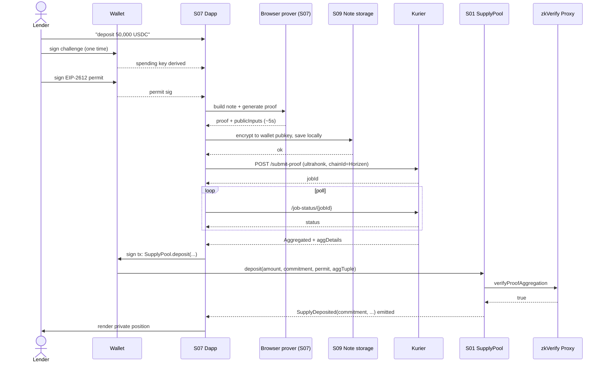
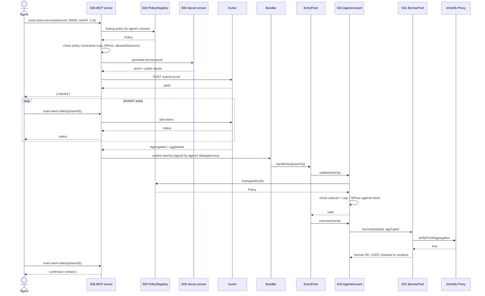
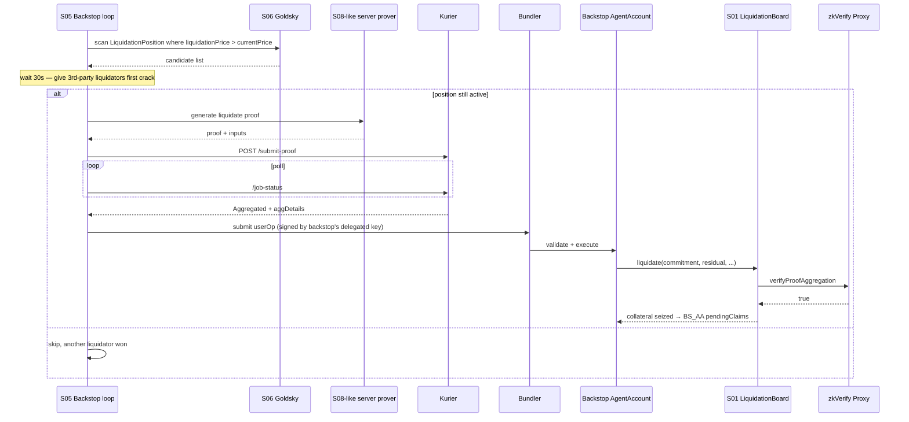
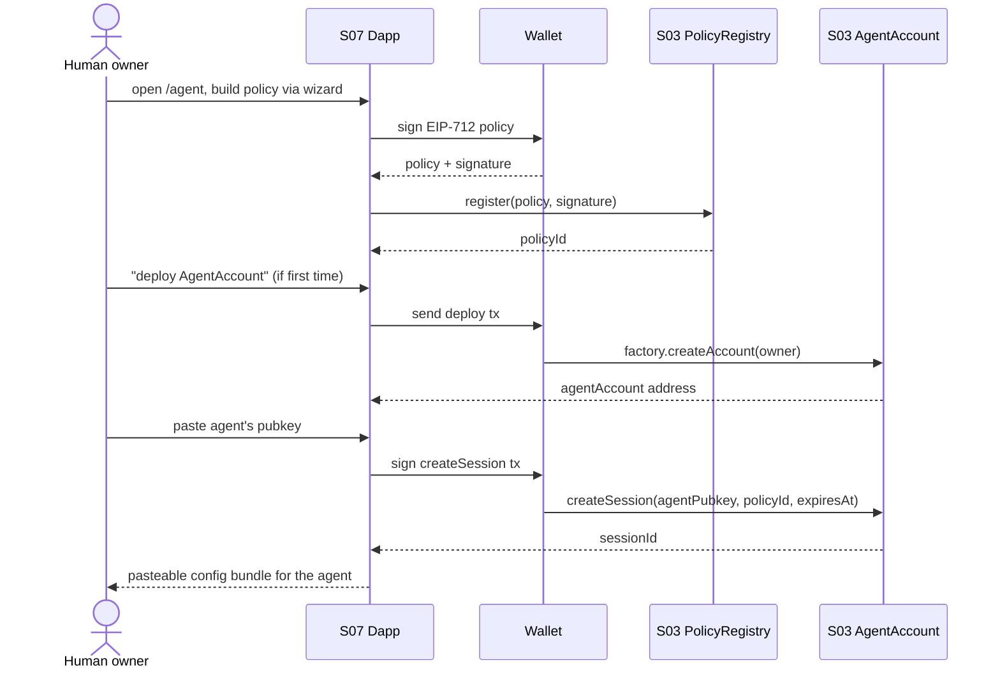
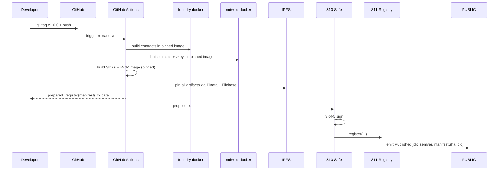
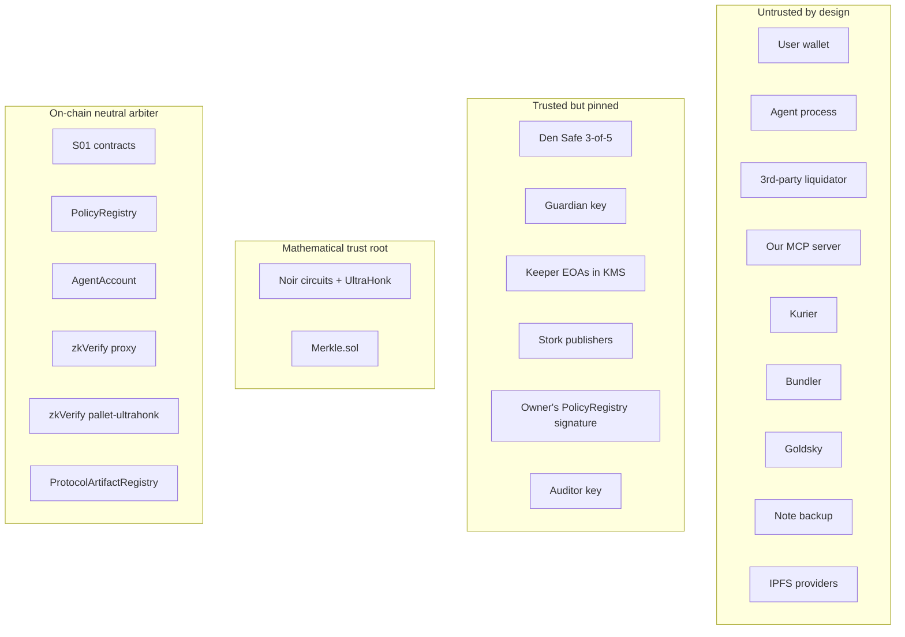

# Integration — How the 11 Subsystems Compose (v2)

Wires the design-v2 subsystems into one end-to-end protocol. Three
sections:

1. **§1 — Master diagram** (every node + every edge).
2. **§2 — Cross-subsystem call table** (each edge enumerated).
3. **§3 — Sequence diagrams** for the 7 main flows: lender deposit (human
   + agent), borrow + collateral deposit, repay, withdraw, liquidate
   (human + agent + backstop), agent delegation, recovery from lost notes,
   release publish.
4. **§4 — Trust boundaries.**
5. **§5 — Decisions carried through** (Phase-7 equivalents).

Subsystem short labels:
- **S01** — Shielded pools & contracts
- **S02** — ZK circuits
- **S03** — Smart accounts & policies
- **S04** — Attestation pipeline
- **S05** — Oracle & keepers
- **S06** — Data layer (subgraph + REST + MCP)
- **S07** — Human frontend
- **S08** — Agent runtime
- **S09** — Note management
- **S10** — Governance & admin
- **S11** — Artifact distribution
- **S12** — Privacy Entry layer (token vault + balance notes)
- **S13** — API contract reference (OpenAPI + JSON Schema + MCP tools)
- **S14** — Interest & APY mechanics (rate curves, index growth, reserve factor)
- **S15** — Threat model & security (mitigations mapped per-subsystem)
- **S16** — Performance characteristics (latency budget + improvement roadmap)
- **S17** — Device support & accessibility (benchmark + server-assisted proving)

---

## §1 — Master diagram

```mermaid
graph TB
  HUMAN[Human user]
  AGENT[AI agent]
  LIQ[Liquidator — human or agent]
  AUD[Auditor]

  subgraph Client surfaces
    UI[S07 Next.js dapp]
    SDKB[Browser prover<br/>bb.js WASM]
    SDKN[Node SDK<br/>S08]
    SDKPY[Python SDK<br/>S08]
    MCP[S06 MCP server]
    REST[S06 REST API]
    NOTEUI[S09 Note management UX]
  end

  subgraph Backend (we operate)
    GS[S06 Goldsky subgraph]
    PG[Postgres jobs + intents]
    PROVE_S[Server-side prover for MCP]
    BUN[ERC-4337 bundler]
    NOTEBACKUP[S09 Note backup service]
    PK[S05 Price keeper]
    IK[S05 Interest keeper]
    BL[S05 Backstop liquidator]
    KMS[AWS KMS]
  end

  subgraph Horizen
    SP[S01 ShieldedSupplyPool]
    BP[S01 ShieldedBorrowPool]
    LB[S01 LiquidationBoard]
    RM[S01 RateModel]
    OR[S01 Oracle]
    ZV[S01 ZkVerifier]
    IF[S01 InsuranceFund]
    AR[S01 AuditorRegistry]
    AA[S03 AgentAccount]
    PR[S03 PolicyRegistry]
    EP[ERC-4337 EntryPoint]
    BS_AA[Backstop AgentAccount]
    REG[S11 ProtocolArtifactRegistry]
    SAFE[S10 Den Safe]
    TIMELOCK[S10 Timelock]
    GUARDIAN[S10 Guardian]
    USDC[USDC OFT]
    CBBTC[cbBTC OFT]
    STORKC[Stork on-chain]
  end

  subgraph zkVerify network
    KUR[Kurier]
    ZKV[zkVerify chain]
    ZKVPROXY[zkVerify Aggregation Proxy on Horizen]
  end

  subgraph Public infrastructure
    STORK_API[Stork REST API]
    IPFS[(IPFS)]
    NPM[npm]
    PYPI[PyPI]
    GHCR[GHCR]
  end

  HUMAN --> UI
  UI --> SDKB
  UI --> NOTEUI
  NOTEUI -- backup --> NOTEBACKUP
  NOTEBACKUP --> IPFS

  AGENT --> SDKN
  AGENT --> SDKPY
  SDKN --> MCP
  SDKPY --> MCP
  LIQ --> MCP
  LIQ --> UI

  UI -- queries --> GS
  UI -- proof submission --> KUR
  MCP --> PG
  MCP --> PROVE_S
  PROVE_S --> KUR
  MCP --> BUN
  BUN -- userOp via EP --> EP
  EP --> AA
  AA --> PR
  AA --> SP
  AA --> BP
  AA --> LB

  REST --> GS
  MCP --> GS

  SP --> ZV
  BP --> ZV
  LB --> ZV
  ZV --> ZKVPROXY

  KUR --> ZKV
  ZKV -- relayer --> ZKVPROXY

  SP --> RM
  BP --> RM
  LB --> OR
  BP --> OR
  OR --> STORKC

  PK -- KMS key --> STORKC
  PK --> STORK_API
  IK --> RM
  BL --> BS_AA
  BS_AA --> LB
  KMS --> PK
  KMS --> IK
  KMS --> BL

  SAFE -- ADMIN --> SP
  SAFE --> BP
  SAFE --> LB
  SAFE --> RM
  SAFE --> IF
  SAFE --> AR
  SAFE --> BS_AA
  SAFE --> REG
  SAFE --> PR
  SAFE -- loosening --> TIMELOCK
  TIMELOCK --> SP
  TIMELOCK --> BP
  TIMELOCK --> RM
  GUARDIAN -- single tx --> SP
  GUARDIAN --> BP
  GUARDIAN --> LB

  REG <-- publish releases --< CI[GitHub Actions]
  CI --> IPFS
  CI --> NPM
  CI --> PYPI
  CI --> GHCR

  AUD --> AR
  AUD --> NOTEBACKUP

  IF -- payBadDebt --> SP
  LB -- bonus split --> IF

  SP -- emit commitments / nullifiers --> GS
  BP --> GS
  LB --> GS
  AA --> GS
  AR --> GS
```

---

## §2 — Cross-subsystem call table (selected)

Highest-traffic edges and their trust/verification properties.

| # | From → To | Data | Trust | Verification |
|---|---|---|---|---|
| 1 | S07/S08 (proof submitter) → S01 (pool deposit/withdraw/borrow/repay) | proof + commitment(s) + nullifier(s) + aggregation tuple | Caller is just a user; nothing privileged | `IVerifyProofAggregation.verifyProofAggregation` |
| 2 | S01 (ZkVerifier) → zkVerify Proxy | Merkle path inputs | Proxy is canonical | `Merkle.sol` verification |
| 3 | S04 (submitter) → Kurier | proof bytes + public inputs | TLS + Kurier API key | TLS; Kurier API key auth |
| 4 | Kurier → zkVerify chain | proof | Trusted to forward | `pallet-ultrahonk.verify_proof` |
| 5 | zkVerify chain → relayer → zkVerify Proxy | aggregation root | Operator role | `onlyRole(OPERATOR)` on proxy |
| 6 | S06 (MCP server) → S04 (submitter) → Kurier | server-side proof submission for agent flows | Internal | (same as #3) |
| 7 | S08 (agent) → S06 (MCP) | typed tool calls | mTLS or session-token; bounded by S03 policy | MCP transport auth; session validates against `PolicyRegistry` |
| 8 | S06 (MCP) → S03 (AgentAccount via bundler) | userOp signed by agent's delegated key | The userOp is signed; AgentAccount validates against policy on-chain | ECDSA + `_validateAgainstPolicy` |
| 9 | S03 (AgentAccount) → S01 (pool entry) | call data | AgentAccount has passed policy check | Pool checks proof + nullifier + agg, none of which AgentAccount can forge |
| 10 | S03 (AgentAccount) → S03 (PolicyRegistry) | policy lookup | Pure view call | None needed |
| 11 | S05 (price keeper) → S01 (Stork on-chain wrapper) | signed Stork update | Stork publisher signatures | Stork's publisher-set check |
| 12 | S01 (pool) → S05/Stork on-chain | price read | Public state | Freshness check (`block.timestamp - priceTs ≤ MAX`) |
| 13 | S05 (backstop) → S03 (Backstop AgentAccount) → S01 (LiquidationBoard) | liquidate userOp | Backstop is itself a delegated agent | Same as #8 + #9 |
| 14 | S07 (dapp) → S09 (note backup) | ciphertext blob | Backup holds ciphertext only | None — service can't decrypt |
| 15 | S09 → S07 (note recovery) | scan subgraph by commitment | Public reads | None needed |
| 16 | S10 (Safe) → S01 / S03 / S11 (admin calls) | governance txs | 3-of-5 hardware-signed | `AccessControl.onlyRole(ADMIN)` |
| 17 | S10 (Safe) → S10 (Timelock) → S01 | loosening param changes | Delayed | `TimelockController.execute` after 48h |
| 18 | S10 (Guardian) → S01 (pause) | single-tx pause | Single hardware key | `_pause()` is the only authorised action |
| 19 | S11 (registry) → public readers | release manifest | Public read | None needed |
| 20 | S06 (subgraph) → S07/S08 | indexed data | Read-only | None — public data |

---

## §3 — Sequence diagrams (selected key flows)

### 3.1 Human lender deposits USDC



### 3.2 Agent-driven borrow



### 3.3 Backstop liquidation (we operate)



### 3.4 Agent delegation setup



### 3.5 Note recovery (after loss)

```mermaid
sequenceDiagram
    actor U as User who lost notes
    participant UI as S07 Dapp
    participant W as Wallet
    participant GS as S06 Goldsky

    U->>UI: "I lost my notes, help me recover"
    U->>W: sign the spending-key challenge
    W-->>UI: spending key derived

    UI->>GS: scan all commitments
    GS-->>UI: full list
    loop for each commitment
        UI->>UI: try-derive (salt, leafIndex) for this commitment;<br/>check if it matches via local re-computation
    end
    UI->>GS: cross-check nullifier set
    GS-->>UI: which derived nullifiers are already spent
    UI-->>U: restored notes list (unspent ones are live)
```

### 3.6 Multi-operation user lifecycle (the PrivacyEntry win)

The most important sequence — shows how wallet visibility compresses to
just two events across a long-running active user.

```mermaid
sequenceDiagram
    actor U as User (0xABC, one main wallet)
    participant W as Wallet
    participant UI as S07 Dapp
    participant PE as S12 PrivacyEntry
    participant SP as S01 ShieldedSupplyPool
    participant BP as S01 ShieldedBorrowPool
    participant LB as S01 LiquidationBoard

    Note over U,LB: ── Day 1: Initial funding ──
    U->>W: sign permit + tx
    W->>PE: deposit(USDC, 100k, commitment, permit) <br/>[PUBLIC: 0xABC → PrivacyEntry, 100k USDC]
    PE->>PE: insert balance-note commitment

    Note over U,LB: ── Day 5: Supply 50k USDC ──
    UI->>UI: generate balance_to_supply proof
    UI->>SP: supply(balanceNullifier, residualBalance,<br/>supplyCommitment, aggTuple)<br/>[no ERC-20 transfer, just commitments]
    SP->>PE: spendBalance(...) — POOL_ROLE
    PE->>PE: spent[nullifier]=true; insert residual balance
    SP->>SP: insert supply commitment

    Note over U,LB: ── Day 7: Deposit cbBTC ──
    U->>W: sign permit + tx
    W->>PE: deposit(cbBTC, 1.0, commitment, permit) <br/>[PUBLIC: 0xABC → PrivacyEntry, 1 cbBTC]

    Note over U,LB: ── Day 10: Lock collateral + borrow 30k ──
    UI->>BP: lockCollateral(...) [no ERC-20]
    BP->>PE: spendBalance(cbBTC) — POOL_ROLE
    UI->>BP: borrow(...) [no ERC-20]
    BP->>PE: creditBalance(newUsdcBalance) — POOL_ROLE
    BP->>LB: updateLiquidationPrice

    Note over U,LB: ── Day 15: Repay 10k of debt ──
    UI->>BP: repay(...) [no ERC-20]
    BP->>PE: spendBalance(USDC, 10k)

    Note over U,LB: ── Day 30: Borrow another 15k ──
    UI->>BP: borrow(...) [no ERC-20]
    BP->>PE: creditBalance(newUsdcBalance)

    Note over U,LB: ── Day 60: Exit — withdraw remaining USDC ──
    UI->>PE: withdraw(balanceNullifier, residualCommitment,<br/>USDC, 0xABC, amount, aggTuple)
    PE->>W: transfer USDC <br/>[PUBLIC: PrivacyEntry → 0xABC, X USDC]

    Note over U,LB: Public touches of 0xABC: TWO deposits + ONE withdraw = 3<br/>(would be 7+ without PrivacyEntry)
```

### 3.7 Release publish (from S11)



---

## §4 — Trust boundaries



### Trust-minimisation per concern

| Concern | Trust answer |
|---|---|
| Will my deposit be safe? | Contract holds custody; only proofs + nullifiers move funds. No off-chain trust. |
| Will my borrow be approved? | Pure circuit check on LTV using public Stork price + public indices. No off-chain trust. |
| Can the MCP server steal funds from my agent? | No — every userOp passes through `AgentAccount` policy check; MCP holds session keys but those are bounded by `PolicyRegistry`. Owner can revoke instantly. |
| Can a liquidator front-run me? | Same as MakerDAO Vaults — they can, the public `liquidationPrice` reveals when. Mitigated by conservative LTV + grace period during ~3-5 min aggregation. |
| Can Kurier corrupt state? | No — they only relay; aggregated proofs verified on-chain. |
| Can Goldsky lie? | No — read path only; cannot affect solvency. |
| Can the note backup service spy on me? | They see ciphertext + access patterns. Solved by uniform-padding + optional Tor / personal IPFS pin. |
| Can the Safe go rogue? | One signer can't; 3-of-5 can change params but cannot mint funds (no minting power on contracts). 48h timelock on protections-loosening. Guardian can pause but cannot unpause or move funds. |
| Can a circuit bug drain the protocol? | Possible — same threat as any ZK protocol. Two ZK auditors before launch (Subsystem 10). Bug bounty. |
| Is the deployed bytecode the audited code? | Verifiable via S11's reproducible builds + on-chain registry. |

---

## §5 — Decisions carried through

The same kind of carry-forward table v1 had. Lists every key decision and
where it's enforced.

| Decision | Source | Enforced at |
|---|---|---|
| ZK + commitments (not VELA) | v2 pivot | S01 contracts + S02 circuits |
| **`PrivacyEntry` layer for "one-wallet user" privacy** | v2 refinement | **S12** + S01 + S02 |
| **Multi-asset positions ({USDC, cbBTC, WETH, ZEN}) from day one** | v2 multi-asset pass | S01 `AssetRegistry`, S02 multi-slot circuits, S03 per-asset policies, S06 asset-parameterized MCP tools, S07 asset selector UI |
| **v1 launch = USDC + cbBTC only; WETH + ZEN added v1.1/v1.2 via Safe** | v2 multi-asset pass | S01 `AssetRegistry.enabled` flag |
| Two markets in v1 (USDC + cbBTC) | architecture §6 | S01 `AssetRegistry` enabled flags |
| Public `liquidationPrice` for discovery | architecture §3 | S01 `LiquidationBoard` + S02 borrow circuit |
| UltraHonk (Noir + bb v3) | architecture §6 | S02, S04 submission body |
| Conservative parameters (LTV 60%, LT 75%, bonus 10%) | architecture §6 | S01 risk params |
| 5% liquidator bonus / 3% to insurance fund | (v1 carried over) | S01 `LiquidationBoard._splitBonus` + S01 `InsuranceFund` |
| ERC-4337 smart accounts for agents | architecture §6 | S03 |
| MCP server first-class | architecture §6 + user req | S06 |
| Kurier as primary; zkVerifyJS fallback | architecture §6 | S04 |
| 3-of-5 Den Safe + Guardian | architecture §6 | S10 |
| Aave v3.3-style bad-debt burn + InsuranceFund | (v1 carried over) | S01 `payBadDebt` + circuits |
| Reproducible builds for all artifacts | new in v2 | S11 |
| Auditor opt-in per deposit (Tornado-Nova) | architecture §1 | S01 `AuditorRegistry` + S02 circuits |
| 48h timelock on protections-loosening | S10 | S10 `TimelockController` |
| No facilitator (gasless) in v1 | (v1 carried over) | not deployed |
| Note backup + recovery story | new in v2 | S09 |
| Backstop liquidator runs on its own AgentAccount | S10 §5 | S05 + S03 |

---

## §6 — What's next

1. **Spike**: prove one circuit (UltraHonk deposit) compiles + verifies
   on Volta. Goal: confirm browser proof generation completes <10s and
   the on-chain `verifyProofAggregation` returns true.
2. **Audit prep**: hand this overview + the 11 subsystem docs to at least
   one ZK-aware firm (Veridise, Zellic) for an architectural-review pass
   before contract code.
3. **Implementation order** (rough dependency order):
   1. S11 build pipeline (so the rest is reproducible from day one).
   2. S01 contracts.
   3. S02 circuits.
   4. S03 smart accounts.
   5. S04 attestation pipeline (SDK + server-side).
   6. S05 keepers.
   7. S06 data layer.
   8. S07 + S08 + S09 (parallel — frontend, agent SDK, note management).
   9. S10 governance (last — once everything else is in place).
4. **Estimate** to audited testnet: ~4-6 months with 3-4 engineers.
5. **Estimate** to audited mainnet: ~6-9 months after audit findings
   addressed.
