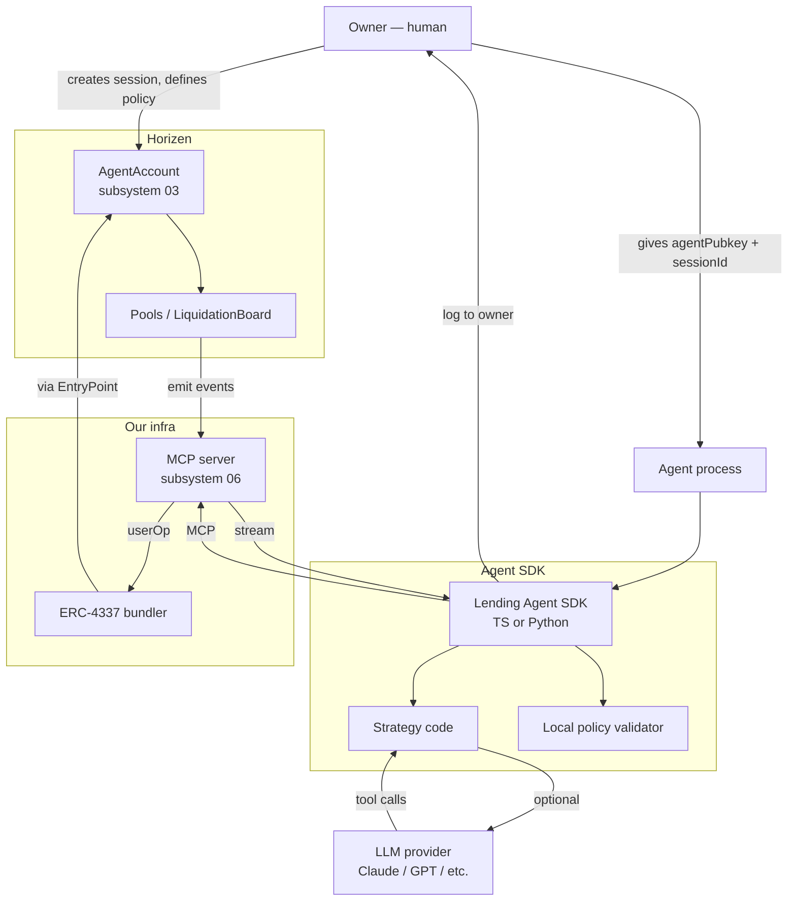

# Subsystem 08 — Agent Runtime

## 1. Purpose

The **client-side machinery agents use to operate the protocol**: a
TypeScript template (LangChain / Mastra / vanilla Node), a Python SDK
(for non-JS ML stacks), example policies, and standard agentic patterns
for autonomous operation.

This is what we'd ship as **open-source repositories** for developers who
want to build bots on our protocol — distinct from the MCP server
(Subsystem 06) which is what we operate.

## 2. The three runtime flavours we ship

### 2.1 TypeScript template (`lending-agent-ts`)

Targets: Node 20+, runs as a long-lived daemon.

```
lending-agent-ts/
├── package.json                  # @lending/agent-sdk, mcp client, ethers
├── src/
│   ├── index.ts                  # main loop
│   ├── policy-validator.ts       # local mirror of on-chain policy check
│   ├── strategies/
│   │   ├── treasury-borrow.ts    # example: maintain a borrow position
│   │   ├── auto-deleveraging.ts  # example: repay when HF dips
│   │   └── liquidator.ts         # example: scan + liquidate
│   ├── llm-orchestrator.ts       # optional: drive strategies via LLM tool-calling
│   └── config.ts
├── examples/
│   ├── basic-borrower-bot.ts
│   ├── liquidator-bot.ts
│   └── llm-managed-treasury.ts
└── README.md
```

### 2.2 Python SDK (`lending-agent-py`)

```
lending-agent-py/
├── pyproject.toml                # mcp-py, pydantic, web3.py
├── lending_agent/
│   ├── __init__.py
│   ├── client.py                 # MCP client wrapper
│   ├── models.py                 # pydantic types matching our REST schema
│   ├── strategies/
│   ├── prover.py                 # optional: wraps the Node prover via subprocess
│   └── config.py
├── examples/
│   ├── basic_bot.py
│   └── llm_treasury.py
└── tests/
```

Python users typically don't have native Noir prover libs; they shell out
to a small Node helper or rely on the MCP server's server-side prover.

### 2.3 Bare MCP client (no SDK)

For LLM platforms that just want to point at our MCP server. ChatGPT
Custom Connectors, Claude Desktop (`claude_desktop_config.json`), any
MCP-compatible IDE / runtime. No code at all from the developer side —
just configure the endpoint.

## 3. Reference strategies (shipped as examples)

### 3.1 Treasury borrow

A DAO holds cbBTC and wants $X working capital in USDC, drawn against the
cbBTC. Agent maintains the position:
- Deposits cbBTC up to policy cap.
- Borrows USDC up to working-capital target.
- Repays USDC when cash arrives.
- Re-borrows when cash leaves.
- Always keeps HF above policy floor (e.g., 2.5).

```typescript
async function treasuryBorrowLoop(mcp: MCPClient, config: Config) {
  while (true) {
    const target = config.targetBorrow;     // e.g., 250_000n * 1_000_000n
    const pos = await mcp.tool("position.get", { commitmentId: state.commitmentId });
    const market = await mcp.tool("market.get", { symbol: "USDC" });

    if (pos.currentDebt < target * 0.95n) {
      const delta = target - pos.currentDebt;
      const intent = await mcp.tool("action.borrow", { amount: delta, minHF: config.minHF });
      const status = await pollIntent(mcp, intent.intentId);
      log(`Borrowed ${delta} USDC, status=${status}`);
    } else if (pos.currentDebt > target * 1.05n) {
      // (and we have USDC in our treasury)
      const delta = pos.currentDebt - target;
      const intent = await mcp.tool("action.repay", { amount: delta });
      await pollIntent(mcp, intent.intentId);
    }

    await sleep(60_000);
  }
}
```

### 3.2 Auto-deleveraging

Watches `events.subscribe({channel: "myPosition", positionId})`. When an
`AtRisk` event fires (HF crossed 1.2 boundary), automatically repays
enough to restore HF to ≥ 1.5. Defends the position before liquidation.

### 3.3 Liquidator bot

```typescript
async function liquidatorLoop(mcp: MCPClient) {
  for await (const evt of mcp.subscribe("liquidations", { marketSymbol: "USDC" })) {
    if (evt.estProfitUSD < MIN_PROFIT_USD) continue;
    if (await isAlreadyConsumed(evt.commitment)) continue;

    const intent = await mcp.tool("action.liquidate", { commitment: evt.commitment });
    const status = await pollIntent(mcp, intent.intentId);
    if (status === "confirmed") log(`Won ${evt.commitment}`);
  }
}
```

### 3.4 LLM-orchestrated treasury (most interesting)

Uses Claude / GPT / open-source LLM with **tool calling** to the MCP server.
The agent gets:
- The MCP tool catalogue.
- A short system prompt: "You're a treasury management agent for the
  Acme DAO. Your job is to maintain working capital between $200k and $300k
  USDC, never letting your borrow position's HF drop below 2.5. Re-check
  every hour. If a liquidation opportunity on a *different* user's position
  appears with > $500 profit, propose acting on it to your owner first."
- A `tools.intent.propose_to_owner` tool for any action the policy says
  needs owner co-sign.

The LLM does its own planning; the agent runtime is just a thin
tool-execution + policy-enforcement layer.

## 4. Common patterns supported

### 4.1 Idempotency

Every action tool returns an `intentId`. Re-calling with the same
`(circuit_kind, public_inputs, ownerAddress, salt)` is idempotent (returns
the same intent).

### 4.2 Owner co-sign

Some policies require owner co-sign before submission. Agent calls
`tools.intent.propose`, gets a pending intent, **the owner is notified
via a webhook** (configurable: email, Discord, push), owner signs via the
dapp's "Pending agent intents" page, agent's poll picks up the green-light
signal.

### 4.3 Streaming events for long-running agents

`tools.events.subscribe` returns an async iterator. The runtime handles
reconnection on transient disconnects.

### 4.4 Local prover caching

For repeated similar proofs (e.g., a liquidator running the same circuit
many times), the SDK caches the circuit's compiled witness encoder so
proof time amortizes.

## 5. Security & privacy

- **Agent runs the SDK; SDK talks to the MCP server.** Agent's process
  doesn't need to hold the user's wallet private key — only the agent's
  delegated session key.
- **Session keys can be revoked instantly** by the owner via the dapp.
- **All proof generation either** runs locally with the SDK (Node version)
  **or** routes through the MCP server's prover. Either way, the agent's
  *process boundary* never contains the owner's spending key in plaintext.
- **TLS to the MCP server is mandatory.** For production agents, mTLS with
  client certificates issued per-agent.
- **Audit log per session.** All actions taken by an agent are recorded in
  the data layer's Postgres + visible to the owner via the dapp.

## 6. Differentiator vs existing agent frameworks

Most DeFi+agent integrations today (e.g., Bankless agents, Eliza plugins,
LangChain DeFi tools) target *transparent* protocols: agents talk to Aave,
Compound, etc. directly. Our differentiator:
- **Native privacy support** — the agent operates on shielded state via
  the same circuits a human would, with no degradation in privacy
  properties.
- **First-class policy enforcement** — built into the contracts, not bolted
  on at the framework layer.
- **MCP-first design** — agents using the new generation of LLM-native
  protocols (Claude with MCP, ChatGPT custom connectors) work out of the
  box.

## 7. Dependencies

- `@modelcontextprotocol/sdk` (TS) / `mcp-py` (Python).
- `@aztec/bb.js` for local prover (TS).
- `ethers` v6 / `web3.py`.
- Optionally `langchain`, `mastra`, or any LLM framework.
- The MCP server endpoint (Subsystem 06).
- An `AgentAccount` + `Policy` set up by the owner (Subsystem 03).

## 8. Distribution

Both SDKs published on npm + PyPI under apache-2.0. Template repos
public on GitHub with clear "fork this to start your bot" READMEs.

## 9. Diagram


