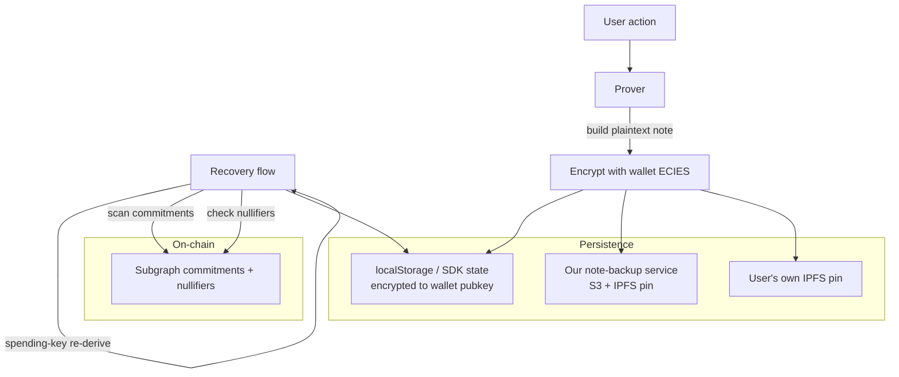

# Subsystem 09 — Note Management (Storage, Backup, Recovery)

## 1. Purpose

How users keep, back up, and recover their **notes** — the
private-key-encrypted records of `(commitment, amount, salt,
spending_pubkey, …)` that prove ownership of supply / borrow positions.
Lose your notes = lose your position. Critical UX subsystem.

## 2. The note lifecycle

```
       user does op (deposit/borrow/repay/withdraw)
                      │
                      ▼
            build note plaintext (in browser or agent process)
                      │
            (1) encrypt with wallet pubkey (ECIES)
                      │
                      ▼
            cipher = encrypted bytes
                      │
            (2) store local                                (3) optional backup
            localStorage / SDK state                       to our backup service
            (instant, free)                                 (small fee, persistent)
                                                                 │
                                                            persist on IPFS
                                                            pinned x 2 services
```

Three independent persistence options; user picks how many to use.

## 3. Storage options

### 3.1 Local (default)

- **Browser:** `localStorage['lendingproto.notes'] = JSON.stringify(ciphers)`.
- **Node SDK:** SDK config writes to `${HOME}/.lending-proto/notes.json`
  (encrypted) or a user-supplied `noteStore` adapter.
- **MCP server:** notes for agent users live on our server in encrypted
  form (encrypted to the **owner's** pubkey, not the agent's — the agent
  has read-decrypt access via its delegated session key + a separate
  decryption credential set by the owner at delegation time).

### 3.2 Our note-backup service (optional)

A thin Cloud Function / serverless backend. Accepts encrypted blobs,
stores them in S3 + IPFS. Indexed by `(walletAddress, commitmentSubsetHash)`.

```
POST /backup
  body: { walletAddress, encryptedNote, commitmentSubsetHash }
GET /backup/{walletAddress}
  → { notes: [encryptedNote, ...] }
```

We **cannot** decrypt anything we store — we hold ciphertext only. The
service charges a small subscription (or one-time payment) per
backup-slot.

### 3.3 IPFS (DIY)

Power users / agents can pin their own backups to IPFS. CID lives in their
own records; we don't track it.

### 3.4 Wallet-integrated (future)

Some wallets (Argent, Safe, etc.) support encrypted data storage natively.
Future integration ships notes to whatever the wallet provides.

## 4. Recovery flow

Worst-case: user loses their notes. They still have their seed phrase
(otherwise game over). Recovery:

1. **Re-derive spending key** from wallet signature (same fixed challenge).
2. **Scan the subgraph** for all commitments where the spending_pubkey
   matches.
3. **For each match**, reconstruct the note plaintext: we know the
   `commitment`, `spending_pubkey`, and (from on-chain events) `amount`
   and `supplyIndex_at_deposit`. The remaining unknown is `salt` — but
   `salt` is **deterministically derived** from
   `keccak256(spending_key || pool_address || leaf_index)` at deposit
   time. With the spending key recovered, all salts re-derive.
4. **Mark spent notes** by cross-referencing the nullifier set: if
   `Poseidon(spending_key || salt)` is already in the spent set, the note
   is consumed.
5. **Restore the unspent subset** as the user's "live" notes.

**This is the same trick Tornado Nova uses.** It works as long as the
spending key derivation is deterministic — which it is, by design.

## 5. Privacy notes

- The note-backup service sees blob sizes and access patterns but not
  contents. We design uniformly-padded blobs to leak no signal about
  position size.
- IPFS CIDs themselves can be correlated to access patterns by network
  observers. Users who care should run a local IPFS node or use Tor.
- We **do not** index notes by `walletAddress` if the user prefers a
  pseudonymous slot (the wallet signs a separate slot key at backup time).

## 6. UX for losing notes

- **Friendly recovery flow** in the dapp, accessible from the "Help"
  panel and on detection of a wallet with on-chain activity but no local
  notes.
- **Clear warning** at signup: "back up your notes — if you lose them, you
  lose access to your private positions. Public addresses can still
  withdraw via the recovery process below, but it can take 1 hour."

## 7. Agent accessibility notes

The MCP server holds notes on behalf of agent-driven users.
Important properties:
- Notes are encrypted to the **owner's pubkey** at deposit time, so the
  MCP server can read ciphertext-only.
- The owner, at policy-creation time, **delegates decryption** by sharing
  a re-encryption key with the MCP server (or encrypting copies of the
  decrypted notes to the agent's pubkey for the session's duration).
- Revoking a session **does not** wipe the notes from the MCP server's
  storage — they're still the user's, just not accessible to that
  particular agent anymore.
- Multi-agent users (a treasury delegates to two different agents
  concurrently) get their notes re-encrypted per session.

## 8. Dependencies

- A small backup service (any serverless runtime + S3 + Pinata).
- Wallet's ECIES encryption (standard EthCrypto-style).
- IPFS pinning provider (Pinata, Filebase).
- localStorage / file system / Postgres.

## 9. Diagram


