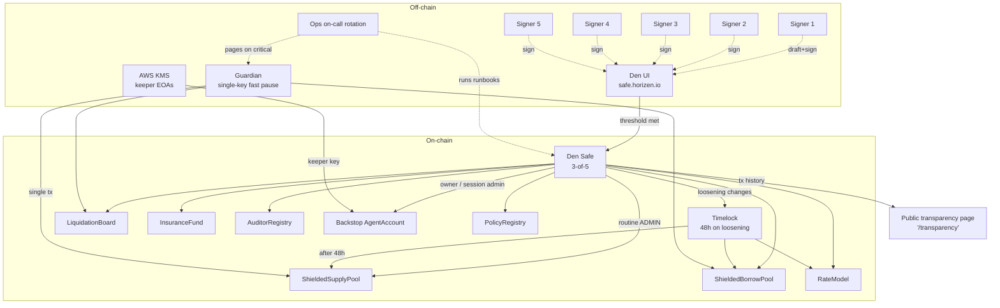

# Subsystem 10 — Governance & Admin

## 1. Purpose

Who controls the privileged operations, how decisions are made and
executed, what the emergency playbook is.

**Same Den-based Safe model as v1**, but adapted to v2's contract surface
(shielded pools instead of VELA's ProcessorEndpoint) and to the new
**agent-related responsibilities** (managing the protocol's own
backstop-liquidator AgentAccount and policy).

## 2. Roles

| Role | Holder | Powers |
|---|---|---|
| `ADMIN_ROLE` (Safe) | 3-of-5 Den multisig | Set risk parameters, pause / unpause, add/remove auditors, top up insurance fund, manage allowed assets. |
| `MANAGER_ROLE` (our backend wallet) | Keeper-EOA in AWS KMS | Push Stork heartbeats, call `RateModel.accrue()`. No fund-moving authority. |
| `GUARDIAN_ROLE` (single signer) | One hardware wallet held by founder + paged on-call | **Fast pause only.** Cannot unpause. Single-tx emergency stop. |
| `LENDING_MARKET_ROLE` (auto-set) | The pools themselves | Call `InsuranceFund.payBadDebt(...)`. |
| `BACKSTOP_OWNER_ROLE` (Safe) | Same Safe | Owner of the backstop-liquidator `AgentAccount`. Can revoke its session. |

## 3. Den Safe configuration

- **3-of-5 threshold** for routine changes.
- **5 signers**, geographically distributed, each with hardware-backed keys
  (Ledger / Yubikey).
- **48h timelock** on **protections-loosening** changes (raising LTV,
  lowering bonus, lowering HF floor). Tightening changes apply
  immediately.
- **Public transparency page** at our domain showing every Safe tx with
  decoded calldata and the risk-relevant fields highlighted.

## 4. Runbooks shipped at launch (under `design-v2/runbooks/`)

Listed by name; actual contents written in the implementation phase:

| File | Covers |
|---|---|
| `parameter_change.md` | How to propose + execute a non-emergency param change. |
| `emergency_pause.md` | Guardian fast-pause flow + how/when to escalate to full Safe vote. |
| `circuit_breaker_reset.md` | After auto-pause from circuit breaker, the verification + reset process. |
| `insurance_fund_topup.md` | When and how to refill from treasury. |
| `auditor_management.md` | Adding / removing auditors; key rotation. |
| `manager_key_rotation.md` | Quarterly key rotation for the keeper-EOAs. |
| `backstop_liquidator_capital.md` | How treasury allocates USDC to the backstop's AgentAccount float. |
| `signer_offboarding.md` | When a Safe signer leaves / loses their key. |
| `bad_debt_response.md` | Step-by-step when bad debt is detected. |
| `contract_migration.md` | Deploying a new pool version + migrating positions (slow on purpose). |
| `audit_finding_response.md` | Triage and remediation flow for audit findings post-launch. |

## 5. Special: managing the backstop AgentAccount

The protocol-operated backstop liquidator (Subsystem 05) runs on top of
Subsystem 03's `AgentAccount` abstraction. It's a customer of our own
agent system.

Setup:
1. Safe deploys `AgentAccount` with `owner = SAFE_ADDRESS`.
2. Safe registers a policy:
   - `allowedContracts = [LiquidationBoard, USDC, cbBTC, AgentAccount swap helper]`
   - `allowedSelectors = [liquidate, transfer, approve]`
   - `spendingCapPerEpoch = ∞` (the backstop needs to be aggressive)
   - `hfFloorBps = 0` (n/a — backstop never borrows)
   - `expiresAt = far future`
3. Safe creates a session for `MANAGER_ROLE`'s keeper EOA pubkey.
4. The keeper service from Subsystem 05 signs userOps with that key.
5. Safe can revoke the session any time — instant kill switch.

This is meaningful: **the protocol's own behaviour is shaped by the same
delegation primitives users get.** No "god mode" for our keepers.

## 6. Emergency procedures (full table)

| Scenario | First action | Recovery |
|---|---|---|
| ZK circuit bug discovered | Guardian pauses; Safe verifies; pause all affected pools | Deploy fixed circuit + new pool; migrate via slow tool |
| Stork prices wildly off | Pause; investigate Stork status | Wait for Stork recovery; resume |
| Subgraph behind / wrong data | No pause — protocol still works; alert users in dapp banner | Indexer ops fix |
| Bundler / EntryPoint outage | Direct-tx fallback path in SDK | Bundler restart; users can also submit directly |
| Kurier outage | SDK fallback to zkVerifyJS direct | Wait for Kurier or rely on fallback indefinitely |
| Backstop float depleted | Top-up runbook | Safe sends USDC; on a long outage, raise treasury alarms |
| Massive Stork price drop (flash crash) | Circuit breaker auto-pauses if > 10% of borrow volume liquidates in 10min | Safe manually resets after verification |
| Safe signer compromised | Other signers urgently rotate via `signer_offboarding.md` | New signer onboarded; old signer's keys never used again |
| Critical CVE in OpenZeppelin / bb / Noir | Emergency pause + investigation | Patched dependency; redeploy; migrate |

## 7. Audit & disclosure policy

- **Bug bounty** via Immunefi or similar, tiered ($50 → $1M depending on
  severity). Set up before mainnet.
- **Coordinated disclosure window** — 90 days for high/critical findings.
- **Audit reports public** (via Subsystem 11's IPFS pinning).

## 8. Dependencies

- Safe / Den deployment on Horizen.
- Hardware wallets for all signers.
- A timelock contract (OpenZeppelin `TimelockController` or similar).
- The Guardian's single signer.
- Subsystem 11 for transparency page hosting.

## 9. Diagram

