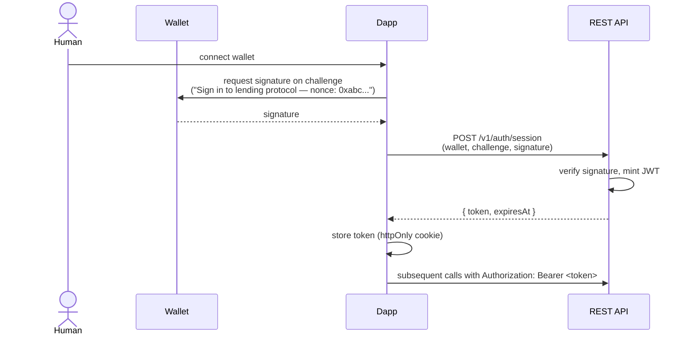
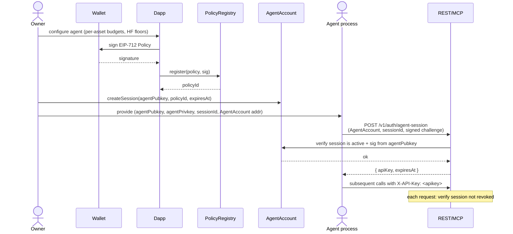
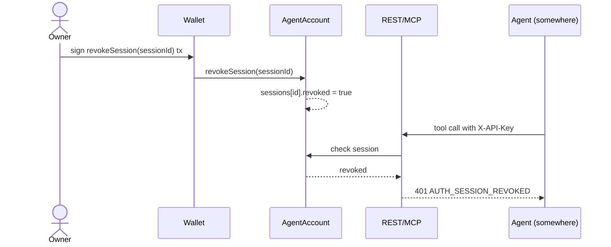

# Subsystem 13 — API Contract Reference

## 1. Purpose

The **canonical specification** of the protocol's external API surface —
what humans, AI agents, SDKs, and third-party integrators see when they
talk to the protocol off-chain. This is the contract every other subsystem
implements against.

Three machine-readable specs live in this subsystem:

- **OpenAPI 3.1** describing the REST API (Layer 5 — humans + 3rd parties).
- **MCP tool schemas** (JSON Schema) describing the typed tools the MCP
  server exposes (Layer 5 — LLM-driven agents).
- **JSON Schemas** for every intent kind's request body, response, and
  status transitions.

Plus design content: auth flows, error model, idempotency, rate limits,
versioning, and streaming events.

## 2. Scope vs other subsystems

| Subsystem | Owns | This subsystem owns |
|---|---|---|
| S01 | Solidity functions | — |
| S02 | Circuit witnesses | — |
| S04 | Kurier submission shape | — |
| S06 | The REST + MCP **server implementation** | The **schema** that server must satisfy |
| S07 | Browser SDK function signatures | The OpenAPI used to generate part of the SDK |
| S08 | Agent runtime patterns | The MCP tool schemas the runtime calls |

S13 is the **interface contract**; S06 is the **server**; S07 / S08 are
**clients**. All three reference the schemas defined here.

## 3. The intent lifecycle (cross-cutting model)

Every action through Layer 5 (REST or MCP) goes through a normalized
**intent state machine**:

```
   submitted ──► RESOLVING ──► PROVING ──► AGGREGATING ──► SETTLING ──► CONFIRMED
                     │            │              │              │
                     └────────────┴──────────────┴──────────────┴─► FAILED
                                                                    │
                                                                    └─► REVERTED (only at SETTLING)
```

States:

| State | Meaning | Caller action |
|---|---|---|
| `RESOLVING` | Server fetching current chain state, locating user's notes | Poll |
| `PROVING` | Server-side circuit witness construction + ZK proof | Poll |
| `AGGREGATING` | Proof submitted to Kurier; waiting for `Aggregated` | Poll |
| `SETTLING` | userOp submitted to ERC-4337 bundler | Poll |
| `CONFIRMED` | Settlement tx mined on Horizen | Done; result available |
| `FAILED` | Unrecoverable error before settlement | Inspect `error`; new intent if applicable |
| `REVERTED` | Settlement tx mined but reverted | Inspect `error.details.revert_reason` |

Every intent has a UUID identifier. Every transition emits a streaming
event. Idempotency keys map to intent IDs.

## 4. OpenAPI 3.1 spec (REST surface)

The full spec lives at `/v1/openapi.json` (served by the data layer) and
at `design-v2/openapi.yaml` (versioned in this repo). Below is the
structural sketch with one full endpoint as an exemplar.

### 4.1 Top-level structure

```yaml
openapi: 3.1.0
info:
  title: Privacy Lending Protocol API
  version: 1.0.0
  description: |
    Multi-asset shielded lending on Horizen. Supports human users via wallet
    + browser proving, and AI agents via ERC-4337 + server-side proving.
servers:
  - url: https://api.lending.example/v1
    description: Mainnet
  - url: https://testnet-api.lending.example/v1
    description: Volta testnet
security:
  - bearerAuth: []
  - apiKeyAuth: []
components:
  securitySchemes:
    bearerAuth:
      type: http
      scheme: bearer
      bearerFormat: JWT
    apiKeyAuth:
      type: apiKey
      in: header
      name: X-API-Key
  schemas:
    # ... see §6 below for intent schemas ...
paths:
  /health: ...
  /assets: ...
  /markets: ...
  /markets/{asset}: ...
  /oracle/prices: ...
  /liquidations: ...
  /intents: ...
  /intents/{id}: ...
  /positions/{ownerAddress}: ...
  /positions/preview: ...
  /agents/{agentAddress}/sessions: ...
  /events: ...
```

### 4.2 Endpoint exemplar — `POST /v1/intents`

```yaml
/intents:
  post:
    summary: Submit a new action intent
    operationId: createIntent
    security:
      - bearerAuth: []
      - apiKeyAuth: []
    parameters:
      - in: header
        name: Idempotency-Key
        schema: { type: string, maxLength: 64, pattern: '^[A-Za-z0-9_-]+$' }
        required: false
        description: |
          Client-chosen key. Replays within 24h return the existing intent
          rather than creating a new one. SDKs auto-compute this from
          (kind, public_inputs, owner, salt).
    requestBody:
      required: true
      content:
        application/json:
          schema:
            oneOf:
              - $ref: '#/components/schemas/EntryDepositIntent'
              - $ref: '#/components/schemas/EntryWithdrawIntent'
              - $ref: '#/components/schemas/SupplyIntent'
              - $ref: '#/components/schemas/WithdrawSupplyIntent'
              - $ref: '#/components/schemas/DepositCollateralIntent'
              - $ref: '#/components/schemas/WithdrawCollateralIntent'
              - $ref: '#/components/schemas/BorrowIntent'
              - $ref: '#/components/schemas/RepayIntent'
              - $ref: '#/components/schemas/LiquidateIntent'
              - $ref: '#/components/schemas/ConsolidateBalanceIntent'
            discriminator:
              propertyName: kind
    responses:
      '202':
        description: Intent accepted; processing started
        content:
          application/json:
            schema:
              $ref: '#/components/schemas/IntentAccepted'
      '400':
        $ref: '#/components/responses/ValidationError'
      '401':
        $ref: '#/components/responses/AuthError'
      '403':
        $ref: '#/components/responses/PolicyError'
      '409':
        description: Idempotency collision
        content:
          application/json:
            schema:
              $ref: '#/components/schemas/IntentAccepted'
      '429':
        $ref: '#/components/responses/RateLimitError'
```

### 4.3 Full endpoint table

| Method | Path | Auth | Idempotent | Streaming |
|---|---|---|---|---|
| `GET` | `/health` | none | — | no |
| `GET` | `/assets` | none | — | no |
| `GET` | `/markets` | none | — | no |
| `GET` | `/markets/{asset}` | none | — | no |
| `GET` | `/markets/{asset}/history` | none | — | no |
| `GET` | `/oracle/prices` | none | — | no |
| `GET` | `/oracle/prices/{asset}` | none | — | no |
| `GET` | `/liquidations` | none | — | no |
| `POST` | `/intents` | bearer / apiKey | yes (`Idempotency-Key`) | no |
| `GET` | `/intents/{id}` | bearer / apiKey | — | no |
| `GET` | `/intents` | bearer / apiKey | — | no |
| `DELETE` | `/intents/{id}` | bearer / apiKey | yes | no |
| `GET` | `/positions/{ownerAddress}` | bearer (owner only) | — | no |
| `GET` | `/positions/{commitmentId}` | bearer (owner only) | — | no |
| `POST` | `/positions/preview` | bearer / apiKey | — | no |
| `POST` | `/proofs` | apiKey | yes | no |
| `GET` | `/proofs/{jobId}` | apiKey | — | no |
| `GET` | `/agents/{agentAddress}/sessions` | bearer / apiKey | — | no |
| `GET` | `/agents/{agentAddress}/policy` | bearer / apiKey | — | no |
| `GET` | `/insurance` | none | — | no |
| `GET` | `/aggregations/{aggregationId}` | none | — | no |
| `GET` | `/events` (SSE) | bearer / apiKey | — | **yes** |
| `GET` | `/openapi.json` | none | — | no |
| `GET` | `/mcp/tools` | none | — | no |

## 5. MCP server tool catalogue

The MCP server speaks the [Model Context Protocol](https://modelcontextprotocol.io/).
Tools are advertised via `tools/list` and invoked via `tools/call`. The
schema below is the **server-side definition** — implementers serve it
verbatim.

### 5.1 Tool list (advertised by `tools/list`)

```typescript
type Tool = {
  name: string;
  description: string;
  inputSchema: JSONSchema7;
};

const tools: Tool[] = [
  // ──── Discovery (no auth) ────
  {
    name: "assets.list",
    description: "List all assets enabled on the protocol.",
    inputSchema: { type: "object", properties: {} },
  },
  {
    name: "market.list",
    description: "Per-asset market metrics: rates, utilization, total supply/borrow.",
    inputSchema: { type: "object", properties: {} },
  },
  {
    name: "market.get",
    description: "Detailed view of one asset's market state.",
    inputSchema: {
      type: "object",
      required: ["asset"],
      properties: {
        asset: { type: "string", enum: ["USDC", "cbBTC", "WETH", "ZEN"] },
      },
    },
  },
  {
    name: "oracle.price",
    description: "Current Stork-fed price for an asset, in USD.",
    inputSchema: {
      type: "object",
      required: ["asset"],
      properties: { asset: { type: "string" } },
    },
  },
  {
    name: "liquidations.scan",
    description: "List positions currently liquidatable. Optionally filter by asset.",
    inputSchema: {
      type: "object",
      properties: {
        collateralAsset: { type: "string" },
        debtAsset: { type: "string" },
        minProfitUSD: { type: "number" },
      },
    },
  },

  // ──── Position read (session required) ────
  {
    name: "position.list",
    description: "All multi-asset positions for an AgentAccount's owner.",
    inputSchema: {
      type: "object",
      required: ["ownerAddress"],
      properties: { ownerAddress: { type: "string", pattern: "^0x[a-fA-F0-9]{40}$" } },
    },
  },
  {
    name: "position.previewAction",
    description: "Compute the resulting HF, triggers, and balance changes WITHOUT submitting.",
    inputSchema: {
      type: "object",
      required: ["actionKind", "asset", "amount"],
      properties: {
        actionKind: { type: "string", enum: ["SUPPLY", "WITHDRAW_SUPPLY", "DEPOSIT_COLLATERAL",
                                              "WITHDRAW_COLLATERAL", "BORROW", "REPAY"] },
        asset: { type: "string" },
        amount: { type: "string" /* uint128 decimal */ },
      },
    },
  },

  // ──── Actions (session required; idempotent) ────
  {
    name: "action.supply",
    description: "Supply an amount of `asset` from your PrivacyEntry balance to the supply pool.",
    inputSchema: {
      type: "object",
      required: ["asset", "amount"],
      properties: {
        asset: { type: "string", enum: ["USDC", "cbBTC", "WETH", "ZEN"] },
        amount: { type: "string" },
        idempotencyKey: { type: "string", maxLength: 64 },
      },
    },
  },
  {
    name: "action.borrow",
    description: "Borrow `amount` of `asset` against your current position's collateral. Reverts if resulting HF would be below `minHF`.",
    inputSchema: {
      type: "object",
      required: ["asset", "amount"],
      properties: {
        asset: { type: "string", enum: ["USDC", "cbBTC", "WETH", "ZEN"] },
        amount: { type: "string" },
        minHF: { type: "number", minimum: 1.0, default: 1.5 },
        idempotencyKey: { type: "string" },
      },
    },
  },
  {
    name: "action.liquidate",
    description: "Liquidate an unhealthy position. Specify which collateral to seize and which debt to repay.",
    inputSchema: {
      type: "object",
      required: ["commitment", "collateralAsset", "debtAsset"],
      properties: {
        commitment: { type: "string", pattern: "^0x[a-fA-F0-9]{64}$" },
        collateralAsset: { type: "string" },
        debtAsset: { type: "string" },
        debtToCover: { type: "string" /* uint128 or "MAX" */ },
        idempotencyKey: { type: "string" },
      },
    },
  },
  // ... action.entry_deposit, entry_withdraw, withdraw_supply, deposit_collateral,
  //     withdraw_collateral, repay, consolidate_balance — same shape pattern ...

  // ──── Intent lifecycle ────
  {
    name: "intent.status",
    description: "Poll the status of a submitted intent.",
    inputSchema: {
      type: "object",
      required: ["intentId"],
      properties: { intentId: { type: "string", format: "uuid" } },
    },
  },
  {
    name: "intent.cancel",
    description: "Cancel an intent that hasn't started settling yet.",
    inputSchema: {
      type: "object",
      required: ["intentId"],
      properties: { intentId: { type: "string", format: "uuid" } },
    },
  },
];
```

### 5.2 Tool response schemas

Each `action.*` tool returns the same shape:

```typescript
type IntentAccepted = {
  intentId: string;            // UUIDv7 with timestamp prefix
  status: "RESOLVING";          // initial state
  estimatedCompletionSeconds: number;
  // Hints for clients to set polling intervals
  pollAfterSeconds: number;
};
```

`intent.status` returns the full intent state (see §6 schema).

### 5.3 Streaming via MCP server-to-client notifications

MCP supports server-initiated notifications. Clients subscribe via:

```typescript
{
  name: "events.subscribe",
  inputSchema: {
    type: "object",
    required: ["channel"],
    properties: {
      channel: {
        type: "string",
        enum: ["position", "intent", "liquidations", "market", "policy"]
      },
      filter: { type: "object" },  // channel-specific
    },
  },
}
```

The server emits `events/notification` messages with the channel's
payload schema (defined in §10).

## 6. Intent kind schemas (the action payloads)

Every action submission's request body matches one of these. The discriminator
is the `kind` field. Below: full schema for `BORROW` (the most complex
of the symmetric set), plus a reference table for the others.

### 6.1 `BorrowIntent` (full schema)

```yaml
BorrowIntent:
  type: object
  required: [kind, asset, amount]
  properties:
    kind:
      type: string
      const: BORROW
    asset:
      type: string
      enum: [USDC, cbBTC, WETH, ZEN]
    amount:
      type: string
      pattern: '^[0-9]+$'
      description: |
        Token-unit amount as a decimal string. For USDC (6 decimals), 30k = "30000000000".
    constraints:
      type: object
      properties:
        minHF:
          type: number
          minimum: 1.0
          default: 1.5
          description: Abort if resulting HF would fall below this.
        deadlineUnix:
          type: integer
          description: Unix timestamp after which the intent is auto-cancelled.
    sourceCommitment:
      type: string
      pattern: '^0x[a-fA-F0-9]{64}$'
      description: |
        Optional. If supplied, the position commitment to borrow against. If
        omitted, the server resolves to the caller's currently-active position.
```

### 6.2 All intent kinds — reference

| `kind` | Required fields | Constraints field | Effect |
|---|---|---|---|
| `ENTRY_DEPOSIT` | `asset`, `amount`, `from` | — | External wallet → balance note |
| `ENTRY_WITHDRAW` | `asset`, `amount`, `recipient` | `sourceCommitment?` | Balance note → external recipient |
| `SUPPLY` | `asset`, `amount` | `sourceCommitment?` | Balance → supply note |
| `WITHDRAW_SUPPLY` | `asset`, `amount` | `sourceCommitment?` | Supply note → balance |
| `DEPOSIT_COLLATERAL` | `asset`, `amount` | `sourceCommitment?` | Balance → position collateral slot |
| `WITHDRAW_COLLATERAL` | `asset`, `amount` | `minHF`, `sourceCommitment?` | Position collateral slot → balance |
| `BORROW` | `asset`, `amount` | `minHF`, `sourceCommitment?` | Increase debt, credit balance |
| `REPAY` | `asset`, `amount` | `sourceCommitment?` | Balance → reduce debt slot |
| `LIQUIDATE` | `commitment`, `collateralAsset`, `debtAsset`, `debtToCover` | — | Seize unhealthy position |
| `CONSOLIDATE_BALANCE` | `asset`, `commitmentsToMerge` (array) | — | Merge 2-8 balance notes |

### 6.3 `Intent` (the polled status object)

```yaml
Intent:
  type: object
  required: [id, kind, status, createdAt]
  properties:
    id: { type: string, format: uuid }
    kind: { $ref: '#/components/schemas/IntentKind' }
    status:
      type: string
      enum: [RESOLVING, PROVING, AGGREGATING, SETTLING, CONFIRMED, FAILED, REVERTED]
    createdAt: { type: string, format: date-time }
    updatedAt: { type: string, format: date-time }
    request: { $ref: '#/components/schemas/AnyIntentRequest' }
    stages:
      type: array
      items: { $ref: '#/components/schemas/IntentStage' }
    result:
      oneOf:
        - $ref: '#/components/schemas/SettledResult'
        - { type: "null" }
    error:
      oneOf:
        - $ref: '#/components/schemas/Error'
        - { type: "null" }
```

## 7. Auth flows (sequence diagrams)

### 7.1 Human dapp auth (Bearer JWT)



JWT contains: `sub: <walletAddress>`, `scope: ["intents:write", "positions:read"]`, `exp`,
issued by our own auth service (no third-party identity provider).

### 7.2 Agent auth (API key derived from delegated session key)



### 7.3 Revocation kills both layers



## 8. Error model

All error responses (HTTP non-2xx) return:

```json
{
  "error": {
    "code": "POLICY_HF_FLOOR_VIOLATED",
    "message": "Resulting HF (1.82) would fall below policy floor (2.0)",
    "retryable": false,
    "category": "VALIDATION",
    "stage": "RESOLVE",
    "details": { /* code-specific */ },
    "intent_id": "01HZ...",
    "request_id": "req_8f3a..."
  }
}
```

### 8.1 Code enumeration (full)

```typescript
type ErrorCode =
  // AUTH_* — re-auth required
  | "AUTH_MISSING"
  | "AUTH_INVALID_TOKEN"
  | "AUTH_EXPIRED"
  | "AUTH_SESSION_REVOKED"
  | "AUTH_INSUFFICIENT_SCOPE"

  // POLICY_* — owner must update policy
  | "POLICY_NOT_FOUND"
  | "POLICY_EXPIRED"
  | "POLICY_ACTION_NOT_ALLOWED"
  | "POLICY_ASSET_NOT_ALLOWED"
  | "POLICY_BUDGET_EXCEEDED"
  | "POLICY_HF_FLOOR_VIOLATED"
  | "POLICY_REQUIRES_OWNER_CONFIRMATION"

  // VALIDATION — caller-side fix
  | "VALIDATION_INVALID_FIELD"
  | "VALIDATION_UNKNOWN_KIND"
  | "VALIDATION_AMOUNT_BELOW_MIN"
  | "VALIDATION_AMOUNT_ABOVE_BALANCE"
  | "VALIDATION_DEADLINE_EXPIRED"

  // STATE_* — refresh and retry sometimes
  | "STATE_NULLIFIER_ALREADY_SPENT"
  | "STATE_NOTE_NOT_FOUND"
  | "STATE_POSITION_NOT_FOUND"
  | "STATE_MARKET_PAUSED"
  | "STATE_ASSET_NOT_BORROWABLE"
  | "STATE_ASSET_NOT_COLLATERALIZABLE"

  // PROOF_* — input error
  | "PROOF_WITNESS_INVALID"
  | "PROOF_GENERATION_FAILED"
  | "PROOF_CIRCUIT_NOT_FOUND"

  // KURIER_* — auto-retried, then escalated
  | "KURIER_UNREACHABLE"
  | "KURIER_RATE_LIMITED"
  | "KURIER_REJECTED"

  // AGG_* — recoverable
  | "AGG_TIMEOUT"
  | "AGG_FAILED"

  // CHAIN_* — settlement issues
  | "CHAIN_REVERT"
  | "CHAIN_UNDERPRICED"
  | "CHAIN_NONCE_TOO_LOW"
  | "CHAIN_INSUFFICIENT_FUNDS"

  // ORACLE_*
  | "ORACLE_STALE"
  | "ORACLE_FEED_DISABLED"

  // RATE_LIMIT
  | "RATE_LIMIT_EXCEEDED"

  // SYSTEM
  | "INTERNAL"
  | "SERVICE_UNAVAILABLE";

type ErrorCategory =
  | "AUTH" | "VALIDATION" | "POLICY" | "STATE"
  | "PROOF" | "RELAY" | "AGGREGATION" | "CHAIN"
  | "ORACLE" | "RATE_LIMIT" | "SYSTEM";
```

### 8.2 Retryability matrix

| Category | Retryable? | Backoff |
|---|---|---|
| AUTH | no — re-auth | — |
| POLICY | no — fix policy | — |
| VALIDATION | no — fix request | — |
| STATE | sometimes | exponential, max 3 attempts |
| PROOF | no — fix inputs | — |
| RELAY | yes | exp, max 5 |
| AGGREGATION | yes | exp, max 3 |
| CHAIN | inspect — usually retryable except REVERT | exp, max 3 |
| ORACLE | yes | linear 30s, max 4 |
| RATE_LIMIT | yes | honour `Retry-After` header |
| SYSTEM | yes | exp, max 3 |

## 9. Idempotency policy

- `POST /v1/intents` accepts `Idempotency-Key: <string>` header.
- Server stores `(api_key, idempotency_key) → intent_id` for **24 hours**.
- On re-submission with the same key, **return the existing intent** (HTTP 200 with the intent body — not 202 with a new one).
- SDKs auto-compute the key as:
  `b64url(sha256(kind || canonical_json(public_inputs) || owner || salt))`
- Re-submission with different body + same key → HTTP 409 `IDEMPOTENCY_KEY_REUSED_WITH_DIFFERENT_BODY`.

This makes every action submission **safe under retries** — required for
agent reliability.

## 10. Streaming events catalogue

The `GET /v1/events` SSE endpoint and the MCP `events.subscribe` tool
both stream channel-filtered events. Channel schemas:

### 10.1 `intent` channel

```typescript
type IntentEvent = {
  channel: "intent";
  intentId: string;
  type: "STAGE_TRANSITION" | "CONFIRMED" | "FAILED" | "REVERTED";
  stage?: "RESOLVING" | "PROVING" | "AGGREGATING" | "SETTLING";
  timestamp: string;
  result?: SettledResult;
  error?: Error;
};
```

### 10.2 `position` channel

```typescript
type PositionEvent = {
  channel: "position";
  positionCommitment: string;
  type: "TRIGGER_CROSSED" | "AT_RISK" | "LIQUIDATED" | "INTEREST_ACCRUED";
  asset?: string;             // for asset-specific events
  hfNow?: number;             // computed from publicly visible triggers + price
  timestamp: string;
};
```

### 10.3 `liquidations` channel

```typescript
type LiquidationEvent = {
  channel: "liquidations";
  type: "NEW_OPPORTUNITY" | "CONSUMED" | "EXPIRED";
  commitment: string;
  collateralAsset: string;
  debtAsset: string;
  estProfitUSD: number;
  liquidator?: string;        // present on CONSUMED
  timestamp: string;
};
```

### 10.4 `market` channel

```typescript
type MarketEvent = {
  channel: "market";
  asset: string;
  type: "RATE_CHANGE" | "PAUSED" | "UNPAUSED" | "PARAMS_UPDATED";
  detail: object;
  timestamp: string;
};
```

### 10.5 `policy` channel (for delegating owners)

```typescript
type PolicyEvent = {
  channel: "policy";
  policyId: string;
  type: "SESSION_CREATED" | "SESSION_REVOKED" | "POLICY_UPDATED" | "BUDGET_EXHAUSTED";
  asset?: string;
  detail: object;
  timestamp: string;
};
```

## 11. Rate limits

Returned via standard headers on every response:

```
X-RateLimit-Limit: 600
X-RateLimit-Remaining: 412
X-RateLimit-Reset: 1716422400
```

On 429:

```
Retry-After: 8
```

### 11.1 Tier table (recap)

| Tier | Reads/min | Action submits/min | Concurrent intents | WS connections |
|---|---|---|---|---|
| Public (no auth) | 60 | — | — | — |
| Human (JWT) | 300 | 10 | 5 | 3 |
| Agent (apiKey) | 600 | 30 | 20 | 10 |
| Agent (paid tier) | 6,000 | 300 | 200 | 50 |

## 12. Versioning policy

- **URI versioning**: `/v1/...`, `/v2/...`.
- **MCP tool versioning**: each tool name carries an implicit `v1`. Breaking
  changes ship as a sibling tool (`action.borrow.v2`) and the old continues
  for ≥6 months.
- **Schema additive changes are non-breaking** — adding optional fields,
  adding new error codes, adding new event types.
- **Breaking changes** — removing fields, renaming, narrowing types, adding
  required fields — bump the version.
- **Deprecation policy**: 6 months from announcement to removal. Every
  deprecated endpoint returns header `Sunset: <date>` and a logged warning.

## 13. Where the spec lives

| Artifact | Location |
|---|---|
| OpenAPI 3.1 source | `design-v2/api/openapi.yaml` (versioned) |
| JSON Schemas (intent kinds) | `design-v2/api/schemas/*.json` |
| MCP tool catalogue (canonical) | `design-v2/api/mcp-tools.ts` |
| Served at runtime | `GET /v1/openapi.json`, `GET /v1/mcp/tools` |
| Generated docs | Redoc → `docs.lending.example/api/v1` |
| Generated TS SDK | `@lending/sdk-browser` and `@lending/sdk-node` via `openapi-generator` |
| Generated Python SDK | `lending-agent-py` (manually maintained for now; auto-gen in v1.1) |

## 14. Audit-relevant notes

- Every action endpoint goes through `AgentAccount`-validated userOps for
  agents and direct wallet-signed txs for humans. There is **no path** by
  which the API server itself can mint/move funds — it only relays proofs.
- The API server's auth tokens grant **off-chain capabilities** (intent
  submission). On-chain authority always flows through wallet/AgentAccount
  signatures.
- Rate limits + idempotency are server-side guarantees only; agents that
  refuse to honour them are limited only by gas economics.

## 15. Dependencies

- OpenAPI 3.1 — spec format.
- JSON Schema 2020-12 — referenced by OpenAPI.
- MCP spec (`https://modelcontextprotocol.io/`).
- `openapi-generator` for SDK generation.
- Redoc for HTML rendering.
- All other subsystems as consumers (S06 implements; S07/S08 call).

## 16. Diagram

```mermaid
graph TB
  subgraph Specs (this subsystem)
    OPENAPI[openapi.yaml<br/>OpenAPI 3.1]
    SCHEMAS[schemas/*.json<br/>JSON Schema per kind]
    MCPSPEC[mcp-tools.ts<br/>MCP tool definitions]
  end

  subgraph Generated artifacts
    REDOC[Redoc HTML]
    TSCLI[TS SDK<br/>auto-generated]
    PYCLI[Python SDK<br/>auto-generated (v1.1)]
    MCPSERVE[MCP tool registry<br/>served at /mcp/tools]
  end

  subgraph Consumers
    UI[S07 Human dapp]
    AGT_TS[S08 TS agent template]
    AGT_PY[S08 Python agent SDK]
    LLM[ChatGPT / Claude / Eliza / ...]
    THIRD[3rd-party integrators]
  end

  subgraph Implementer
    BACKEND[S06 REST + MCP server<br/>satisfies the spec]
  end

  OPENAPI --> REDOC
  OPENAPI --> TSCLI
  OPENAPI --> PYCLI
  MCPSPEC --> MCPSERVE
  SCHEMAS --> OPENAPI
  SCHEMAS --> MCPSPEC

  TSCLI --> UI
  TSCLI --> AGT_TS
  PYCLI --> AGT_PY
  MCPSERVE --> LLM
  REDOC --> THIRD

  BACKEND -. must satisfy .-> OPENAPI
  BACKEND -. must satisfy .-> MCPSPEC
  BACKEND -. must satisfy .-> SCHEMAS
```
