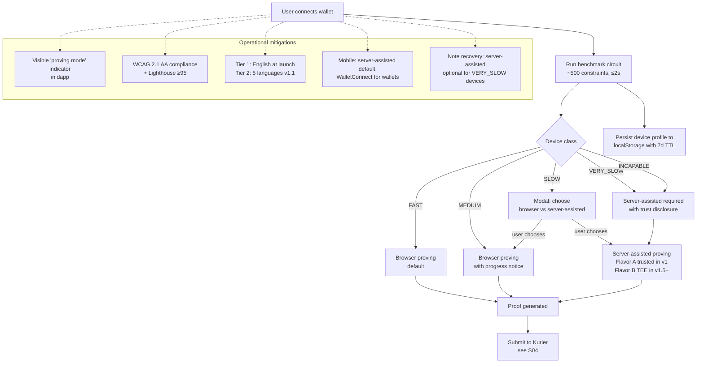

# Subsystem 17 — Device Support & Accessibility

## 1. Purpose

The **authoritative reference** for what devices can run the dapp, how
we detect device capability, and how we fall back gracefully when
browser-side ZK proving is too expensive for the user's hardware.

This subsystem addresses the **device-class gap** that the v2 design
otherwise assumes away: ZK proving is computationally heavy, and a
material fraction of real users have old or low-powered computers.

## 2. The honest device-support matrix

Browser-side ZK proof generation (`@aztec/bb.js` running UltraHonk) for
our most demanding circuit (~13k constraints, `borrow` / `liquidate`):

| Device class | Proof time | RAM during proving | Verdict |
|---|---|---|---|
| Modern desktop M-series Mac (2020+) | 5-8s | ~1.5 GB | **Fully supported, browser proving** |
| Modern Intel i7 / Ryzen 7 laptop (2020+) | 8-15s | ~1.5-2 GB | **Fully supported, browser proving** |
| Older Intel i5 / Ryzen 5 (2016-2019) | 30-60s | ~2-3 GB | Supported but slow; **recommend server-assisted** |
| Older laptops (Atom / Celeron / pre-2016 i3) | 1-3 min or OOM | ≥3 GB | **Server-assisted required** |
| Modern iPhone (iPhone 13+, Safari) | 15-25s | ~700 MB (Safari WASM cap) | Supported; **recommend server-assisted** for UX |
| Modern Android (2022+, mid-tier or higher) | 20-40s | ~1-2 GB | Supported; **recommend server-assisted** for UX |
| Low-end Android (<2GB RAM) | Fails (OOM) | OOM | **Server-assisted required** |
| Very old browsers without WebAssembly | N/A | N/A | **Not supported** — browser update required |

**Estimated user-base split in v1:**
- ~60% modern hardware → browser proving by default
- ~25% mid-range → browser works but server-assisted improves UX
- ~10% old hardware → server-assisted required
- ~5% incompatible → onboard via wallet-update guidance

We **cannot** afford to lose the 10-15% on older devices. Server-assisted
proving is the answer.

## 3. Why browser ZK proving has limits

Specific browser constraints:

1. **WASM linear memory cap**: Safari caps at ~512 MB; older Chrome
   caps at 2 GB; some mobile browsers cap lower. Large circuits OOM.
2. **Single-threaded by default**: WebAssembly threads require COOP/COEP
   HTTP headers AND a SharedArrayBuffer; not universal.
3. **No AVX2 / SIMD**: barretenberg uses SIMD optimizations that fall
   back to slow paths on pre-2013 CPUs.
4. **Battery thermal throttling**: 30-second compute drains battery
   significantly and triggers throttling on cheap phones.
5. **Tab-throttling**: backgrounded tabs may be paused, breaking
   in-flight proving.

None of these are bugs we can patch — they're browser/hardware limits.
The solution is to **detect and fall back**, not to fight physics.

## 4. The detection + benchmark flow

On first wallet connect, the dapp runs a tiny benchmark circuit (~500
constraints, takes ≤2s on a phone) to estimate device speed.

```typescript
// apps/web/src/lib/device-benchmark.ts
async function benchmarkDevice(): Promise<DeviceProfile> {
  const start = performance.now();
  try {
    await runBenchmarkCircuit();         // a 500-constraint warmup proof
  } catch (e) {
    if (isOutOfMemory(e)) return { class: "INCAPABLE", proving: "server-required" };
    throw e;
  }
  const elapsed = performance.now() - start;

  // Extrapolate to the 13k-constraint borrow circuit (roughly 26x larger)
  const projectedBorrow = elapsed * 26;

  if (projectedBorrow < 5000)  return { class: "FAST",     proving: "browser-default" };
  if (projectedBorrow < 20000) return { class: "MEDIUM",   proving: "browser-ok" };
  if (projectedBorrow < 60000) return { class: "SLOW",     proving: "server-recommended" };
  return                           { class: "VERY_SLOW", proving: "server-required" };
}
```

The result is cached in `localStorage` with a 7-day TTL (re-benchmark
weekly to catch device upgrades / new browser optimizations). UI surfaces
the result with an explanation.

| Class | Default proving strategy | UI signal | Override allowed? |
|---|---|---|---|
| `FAST` | Browser | Silent (no notice) | Yes — can opt into server |
| `MEDIUM` | Browser | "Operations may take ~10-15s to prepare in your browser" | Yes |
| `SLOW` | Browser with warning OR opt-in server | Modal: "Your device is slow — switch to faster server-assisted proving? Your data leaves your device under TLS but our server only sees your operation, not your wallet." | Recommends server |
| `VERY_SLOW` | Server-assisted forced (with notice) | "Browser proving isn't supported on this device. Server-assisted proving will be used." Plus the same trust disclosure. | No (server is required) |
| `INCAPABLE` | Server-assisted forced; wallet operations fall through | Same | No |

The user can ALWAYS see which mode is active via a small indicator near
the wallet status (showing "browser proving" or "server-assisted").

## 5. Server-assisted proving — two flavors

The mitigation for slow devices is server-assisted proving. There are
two privacy flavors, with different trust requirements:

### 5.1 Flavor A — Trusted server (v1 default)

**How it works:**
1. User selects "Use accelerated proving" or auto-detected for slow devices.
2. The dapp **uploads the witness over TLS** to our prover service.
3. The witness includes the user's private inputs for that operation.
4. Server runs the prover; returns the proof.
5. Server immediately destroys the witness after proof generation.

**Trust assumption:** the server doesn't log or retain witness data.
This is verifiable through:
- Open-source server code (S11 reproducible builds).
- Audit log of every proof generated (no witness contents logged).
- Public bug bounty for any retention bug.

**Trade-off:** user must trust our server with one operation's secrets.
The server **never sees the user's spending key** — only the public
inputs + the witness for this specific operation.

| | Value |
|---|---|
| Owner | [S06](06_data_layer.md) prover service + [S07](07_human_frontend.md) opt-in UX |
| Build | New service alongside the MCP server backend; same reproducible-build pipeline ([S11](11_artifact_distribution.md)) |
| Cost | ~1 EC2 instance per ~50 concurrent users; small fleet for v1 |
| Trust level | Single-trust-server; mitigated by open-source code + audit log |
| Privacy impact | One-operation secret leaks to server (not the spending key) |
| Implementation timing | **v1 launch** — required for accessibility |

### 5.2 Flavor B — TEE-based server proving (v1.5+)

**How it works:**
1. Server runs the prover **inside an enclave** (AWS Nitro or Intel TDX).
2. Witness is encrypted to the enclave's public key on the client side.
3. Enclave decrypts internally, proves, returns proof; the host OS
   never sees plaintext.
4. The enclave attestation document is published so users can verify
   the binary is the audited version.

**Trust assumption:** AWS Nitro / Intel TDX security guarantees.
Same model VELA used in v1 (which we dropped). Real but more nuanced.

| | Value |
|---|---|
| Owner | [S06](06_data_layer.md) extended with enclave runtime |
| Build | TEE infrastructure work + remote attestation flow |
| Cost | Higher than Flavor A; needs Nitro-capable instances |
| Trust level | Cryptographic + hardware; significantly stronger than Flavor A |
| Privacy impact | Witness encrypted to enclave; host can't observe |
| Implementation timing | **v1.5+** — premium tier; not blocking v1 launch |

## 6. Mobile-specific considerations

Mobile is structurally harder than desktop:

| Concern | Mitigation |
|---|---|
| **iOS Safari WASM memory cap (~512 MB)** | Use server-assisted proving by default on mobile in v1; smaller circuits (entry_deposit/withdraw_supply at ≤5k constraints) can still run in-browser |
| **Background tab throttling** | Submit proof + receive jobId before requesting wallet signature; if backgrounded mid-process, intent is queued server-side and resumes |
| **Thermal throttling on cheap phones** | Don't try; default to server-assisted |
| **Wallet apps (MetaMask Mobile, Coinbase Wallet)** | Use WalletConnect for inter-app communication; tested with major mobile wallets at launch |
| **Battery drain warning** | If running browser proving on mobile, show a warning before the first proof: "Operations on mobile may use significant battery." |

**Net mobile UX strategy:** server-assisted proving **by default** on
mobile in v1. Users can opt back into browser proving in settings if
they have a powerful phone and want maximum privacy.

## 7. Web accessibility (a11y)

Privacy lending shouldn't be a feature only available to abled users.
The dapp ([S07](07_human_frontend.md)) commits to WCAG 2.1 Level AA at
minimum.

| Concern | Mitigation |
|---|---|
| **Screen reader support** | All UI elements have semantic HTML + ARIA labels; no information conveyed by color alone |
| **Keyboard navigation** | Full keyboard navigation; visible focus indicators; tab order matches visual order |
| **Color contrast** | All text ≥4.5:1 contrast; large text ≥3:1 |
| **Motor impairment** | All click targets ≥44×44 px; no time-limited interactions (the proof-waiting modal persists until resolved) |
| **Cognitive accessibility** | Plain-language error messages; visual progress indicators; consistent layout |
| **Visual impairment** | Respects system font size; pinch-zoom enabled; layouts reflow at 320px width |

**Accessibility audit before mainnet** by [Deque](https://www.deque.com)
or equivalent. Cost ~$10-15k.

## 8. Internationalization (i18n)

Privacy protocols see disproportionate use from non-English-speaking
regions where financial privacy has real-world value.

| Language tier | Languages | Approach |
|---|---|---|
| Tier 1 (v1 launch) | English | Default |
| Tier 2 (v1.1) | Spanish, Mandarin, Russian, Korean, Japanese | Community translation + paid native review |
| Tier 3 (v1.2+) | Arabic (incl. RTL), Portuguese, Turkish, Vietnamese, French | Community translations |
| Tier 4 (future) | Long tail | Community-led |

Implementation:
- All UI strings in extracted resource bundles from day one.
- Locale stored per-user in dapp settings.
- RTL layout support (Arabic) is a baked-in CSS concern, not an
  afterthought.

## 9. Offline and connectivity-degraded scenarios

The dapp must gracefully degrade when network is poor.

| Scenario | Behavior |
|---|---|
| Subgraph unreachable | Use on-chain RPC directly for read flows; show "indexed data stale" banner |
| Kurier API unreachable | Fall back to zkVerifyJS direct submission ([S04](04_attestation_pipeline.md)) |
| Horizen RPC unreachable | Detect via connect test; show banner "Horizen network unreachable — retrying"; allow user to switch RPC endpoint |
| Browser offline mid-proof | Cache the proof in localStorage; resume on reconnect |
| MCP server unreachable (agent flows) | Agents fall back to direct on-chain submission via their AgentAccount |
| All paths fail | "We're investigating" status page; auto-retry policy in SDKs |

## 10. Wallet support

| Wallet | v1 supported? | Notes |
|---|---|---|
| MetaMask Desktop / Mobile | **✓** | Primary tested wallet |
| Rabby | **✓** | Tested; recommended for power users |
| Coinbase Wallet | **✓** | Tested; mobile + desktop |
| WalletConnect-compatible (any) | **✓** | Via WalletConnect v2 |
| Safe | **✓** | Via Safe app integration (multisig DAOs / treasuries) |
| Hardware wallets (Ledger / Trezor) | **✓** | Via MetaMask / Rabby integration |
| SubWallet / Talisman | Optional | Useful for zkVerify-side ops; not required for dapp |
| Pure browser-extension wallets without WalletConnect | Partial | Need EIP-1193 compatibility |
| Wallets that don't support EIP-712 | **✗** | Required for policy signatures (agent flow); users with these wallets cannot delegate to agents |

**v1 launch tested matrix:** MetaMask (Desktop + Mobile), Rabby, Coinbase
Wallet, Safe app, plus WalletConnect with at least 3 other major wallets.
Listed publicly in dapp's "Supported wallets" page.

## 11. The note-recovery accessibility concern

Per [S09](09_note_management.md), users who lose their notes can recover
from their seed phrase. This recovery process must work on the user's
device, including old devices.

**Constraint:** the recovery scan iterates over all on-chain commitments
to find the user's notes. For a pool with thousands of commitments, this
can take time.

| Device class | Estimated recovery time |
|---|---|
| FAST | <30s for typical user |
| MEDIUM | 1-3 min |
| SLOW | 5-15 min |
| VERY_SLOW | Use server-assisted recovery (with same trust model as 5.1) |

Server-assisted recovery is a sibling endpoint to server-assisted
proving — the user uploads their spending key over TLS (one-time;
for recovery only), the server scans the commitments and returns the
user's notes, then the server destroys the spending key immediately.

This is the **strongest privacy compromise** in the system — but it's
optional, one-time, and survives device loss. Documented in
[S09](09_note_management.md).

## 12. Implementation impact

Adding S17 to the design touches:

| Subsystem | Change |
|---|---|
| [S06](06_data_layer.md) | **NEW** server-assisted prover service alongside MCP server |
| [S07](07_human_frontend.md) | Device benchmark on first connect; adaptive proving strategy; mobile defaults; a11y review |
| [S09](09_note_management.md) | Add server-assisted recovery endpoint (optional, opt-in) |
| [S11](11_artifact_distribution.md) | Reproducible build for the new prover service |
| [S13](13_api_contract.md) | Add `acceleratedProving` flag on intents; document the trust tradeoff in the API spec |
| [S15](15_threat_model.md) | Add threats for server-assisted proving + new mitigations |
| [S16](16_performance.md) | Document the speed tier this enables |

**Build effort:** ~2-3 weeks for v1 (Flavor A trusted server) + UI
benchmark + locale framework. Auditing the prover service adds ~1 week.

## 13. SLO targets for accessibility

| SLO | Target | Owner |
|---|---|---|
| Device detection (benchmark) completes | <3s on FAST/MEDIUM; <5s on SLOW | [S07](07_human_frontend.md) |
| Server-assisted proof generation, p95 | <3s for any circuit | [S06](06_data_layer.md) |
| Server-assisted prover availability | 99.9% | [S06](06_data_layer.md) ops |
| Lighthouse accessibility score | ≥95 | [S07](07_human_frontend.md) CI |
| Mobile-friendly (Google PageSpeed Insights) | ≥90 | [S07](07_human_frontend.md) CI |
| i18n string coverage (Tier 2 languages) | 100% UI; 80% help docs | [S07](07_human_frontend.md) |
| WCAG 2.1 AA compliance | Verified by external audit | external |

## 14. Open work for accessibility

Before launch:

1. Build the device-benchmark circuit + UI flow (v1)
2. Build server-assisted prover service (v1)
3. Build i18n framework (v1; Tier 1 only)
4. WCAG 2.1 AA pass via Deque or equivalent
5. Mobile wallet integration test matrix
6. Recovery on slow-device test (Spike 8, TBW)

## 15. Dependencies

- [S02](02_zk_circuits.md) — circuit definitions (server uses same circuits)
- [S04](04_attestation_pipeline.md) — proof submission (whether browser
  or server originated)
- [S06](06_data_layer.md) — server prover service hosting
- [S07](07_human_frontend.md) — UI for device detection + proving choice
- [S09](09_note_management.md) — server-assisted recovery
- [S11](11_artifact_distribution.md) — reproducible builds for the
  prover service
- [S13](13_api_contract.md) — `acceleratedProving` field on intent
- [S15](15_threat_model.md) — threat coverage for the new attack surface
- [S16](16_performance.md) — speed tier this enables

## 16. Diagram


